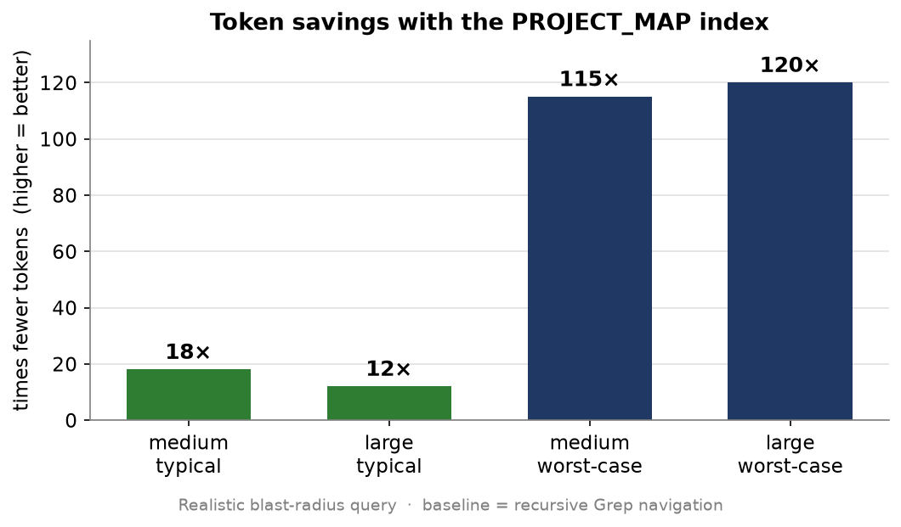

# claude-dependency-mapper

[](https://github.com/Bakoware/claude-dependency-mapper/releases/latest)
[](./LICENSE)

A [Claude Code](https://claude.com/claude-code) skill that maps your project's
dependency graph into two complementary artifacts from a single static-import analysis:

1. **A human graph** — an [Obsidian](https://obsidian.md) vault (`obsidian-graph/`) with
   one note per file and `[[wikilinks]]` between them. Open the folder as a vault and use
   the **Graph View** to see your architecture, spot dead code, and gauge a change's
   blast radius.
2. **An AI graph** — a compact, single-file `PROJECT_MAP.md` adjacency list that Claude
   can read **once** to know which files import (and are imported by) any target, instead
   of repeatedly fanning out with Grep/Glob. On medium/large projects this saves tokens.

It also wires up `.gitignore` and `CLAUDE.md`, and installs a hook that **auto-refreshes
the graphs whenever you edit source files** — so both views stay current with no manual
step.

> **Languages** (auto-detected by extension): JavaScript/TypeScript
> (`.ts .tsx .js .jsx .mjs .cjs .mts .cts .vue .svelte .astro`), Python (`.py .pyi`),
> Rust (`.rs`), and Dart (`.dart`). Resolution is best-effort and regex-based — see
> [Limitations](#limitations).

---

## 📊 Token savings — measured, not claimed

The index turns a multi-call recursive search into a **single read**. On a transitive
blast-radius query it cut tokens **~12–18× on a typical question and up to ~120× on big
refactors**, and tool calls from *one-per-affected-file* down to **1**:



Full reproducible methodology, charts, and an independent real-agent validation:
**[benchmark/README.md »](skills/claude-dependency-mapper/benchmark/README.md)**

---

## Quick install

**As a Claude Code plugin (recommended)** — run inside Claude Code:

```
/plugin marketplace add Bakoware/claude-dependency-mapper
/plugin install claude-dependency-mapper@bakoware
```

You get managed updates (`/plugin marketplace update`) and discovery from the CLI.

**As a plain skill (no plugin system)** — one command, no script:

*macOS / Linux:*

```bash
git clone --depth 1 https://github.com/Bakoware/claude-dependency-mapper.git /tmp/cdm \
  && mkdir -p ~/.claude/skills \
  && cp -r /tmp/cdm/skills/claude-dependency-mapper ~/.claude/skills/ \
  && rm -rf /tmp/cdm
```

*Windows PowerShell:*

```powershell
git clone --depth 1 https://github.com/Bakoware/claude-dependency-mapper.git "$env:TEMP\cdm"; `
New-Item -ItemType Directory -Force "$HOME\.claude\skills" | Out-Null; `
Copy-Item -Recurse -Force "$env:TEMP\cdm\skills\claude-dependency-mapper" "$HOME\.claude\skills\"; `
Remove-Item -Recurse -Force "$env:TEMP\cdm"
```

Either way, run `/claude-dependency-mapper` in any project afterwards. See
[Installation](#installation) for the installer script, download, and per-project options.

---

## How it works

When you run `/claude-dependency-mapper` in a project, the skill:

1. Finds the source base (`src/` if present, otherwise the project root), ignoring
   `node_modules`, build output, `.git`, etc.
2. Parses static imports per language (relative paths, aliases, module paths) to build the
   dependency graph.
3. **Picks a route by code-file count:**
   - **`< 40` files → "directed":** the project is small enough that Claude's normal
     Grep/Glob exploration is cheap, so **no** `PROJECT_MAP.md` is generated (a stale map
     would cost more tokens than it saves).
   - **`>= 40` files → "compact":** a precomputed `PROJECT_MAP.md` is generated and
     `CLAUDE.md` instructs Claude to read it first.
   - The human Obsidian vault is generated in **both** cases.
4. Inserts/refreshes managed blocks in `.gitignore` (so the graphs aren't committed) and
   `CLAUDE.md` (route-specific navigation guidance for future sessions).
5. Installs a project-scoped `PostToolUse` hook in `.claude/settings.json` that
   regenerates the graphs whenever a source file is edited.

Everything is **idempotent** — re-running only rewrites the managed blocks and never
duplicates them, and existing hooks/settings are preserved.

---

## Requirements

- [Claude Code](https://claude.com/claude-code)
- [Node.js](https://nodejs.org) 18+ (the generator is a single `.mjs` script, no
  dependencies)
- A project in a supported language (JavaScript/TypeScript, Python, Rust, or Dart)
- *(Optional)* [Obsidian](https://obsidian.md) to view the human graph

---

## Installation

### Option A — plugin (recommended)

This repo is also a [Claude Code plugin marketplace](https://code.claude.com/docs/en/plugin-marketplaces).
Inside Claude Code:

```
/plugin marketplace add Bakoware/claude-dependency-mapper
/plugin install claude-dependency-mapper@bakoware
```

You get CLI discovery and managed updates (refresh the catalog with
`/plugin marketplace update`).

> The options below install it as a plain skill (no plugin system). The skill lives in
> your Claude Code skills directory:
> `~/.claude/skills/` on **macOS** and **Linux**, `%USERPROFILE%\.claude\skills\` on
> **Windows**.

### Option B — one-line clone (no plugin, no script)

**macOS:**

```bash
git clone --depth 1 https://github.com/Bakoware/claude-dependency-mapper.git /tmp/cdm \
  && mkdir -p ~/.claude/skills \
  && cp -r /tmp/cdm/skills/claude-dependency-mapper ~/.claude/skills/ \
  && rm -rf /tmp/cdm
```

**Linux:** identical to macOS (bash/zsh) — same command works as-is:

```bash
git clone --depth 1 https://github.com/Bakoware/claude-dependency-mapper.git /tmp/cdm \
  && mkdir -p ~/.claude/skills \
  && cp -r /tmp/cdm/skills/claude-dependency-mapper ~/.claude/skills/ \
  && rm -rf /tmp/cdm
```

**Windows PowerShell:**

```powershell
git clone --depth 1 https://github.com/Bakoware/claude-dependency-mapper.git "$env:TEMP\cdm"; `
New-Item -ItemType Directory -Force "$HOME\.claude\skills" | Out-Null; `
Copy-Item -Recurse -Force "$env:TEMP\cdm\skills\claude-dependency-mapper" "$HOME\.claude\skills\"; `
Remove-Item -Recurse -Force "$env:TEMP\cdm"
```

### Option C — clone and run the installer

The installer copies the skill into your skills directory for you:

```bash
git clone https://github.com/Bakoware/claude-dependency-mapper.git
cd claude-dependency-mapper
./install.sh        # macOS / Linux
./install.ps1       # Windows PowerShell
```

### Option D — manual install (download)

1. On the repo page, click **Code → Download ZIP** and extract it.
2. Copy the inner `skills/claude-dependency-mapper/` folder into your skills directory so
   the final path is:
   - macOS / Linux: `~/.claude/skills/claude-dependency-mapper/SKILL.md`
   - Windows: `%USERPROFILE%\.claude\skills\claude-dependency-mapper\SKILL.md`

After any of these, Claude Code discovers the skill automatically (start a new session if
one was already open).

### Per-project install

To use it in only one project (not globally), copy `skills/claude-dependency-mapper/`
into that project's `.claude/skills/` directory instead.

---

## Usage

Inside any supported project, run:

```
/claude-dependency-mapper
```

You'll get a summary like:

```
obsidian-graph/  : 70 notes
PROJECT_MAP.md   : written (compact route)
.gitignore       : managed block updated
CLAUDE.md        : managed block updated
auto-refresh hook: installed in .claude/settings.json
RESULT: files=70 route=compact threshold=40 src=src
```

### View the human graph in Obsidian

1. Open Obsidian → **Open folder as vault** → select the project's `obsidian-graph/`.
2. Press **Ctrl/Cmd + G** for the Graph View.
3. *(Optional)* In Graph View → **Groups**, color nodes by `tag:#component`, `tag:#ui`,
   `tag:#app`, etc.

### Auto-refresh

After the first run, the installed hook regenerates the graphs whenever you edit a source
file. The hook is gated to source files (other edits are ignored), runs quietly, never
touches your config after setup, and never blocks an edit. Re-run
`/claude-dependency-mapper` manually only to re-apply config or change the route.

---

## Options

You can run the generator directly with flags (the skill runs it for you):

```bash
node gen-graph.mjs [projectRoot] [--threshold=40] [--route=directed|compact]
```

| Flag                  | Description                                                        |
| --------------------- | ----------------------------------------------------------------- |
| `--threshold=N`       | File count at which the route switches to `compact` (default 40). |
| `--route=directed`    | Force directed mode (no `PROJECT_MAP.md`).                         |
| `--route=compact`     | Force compact mode (always write `PROJECT_MAP.md`).               |
| `--no-config`         | Regenerate graphs only; don't touch `.gitignore`/`CLAUDE.md`/hook. |
| `--quiet`             | Suppress output.                                                   |
| `--hook`              | Internal mode used by the auto-refresh hook (reads stdin).         |

---

## What gets added to your project

| Path                         | Purpose                          | Committed? |
| ---------------------------- | -------------------------------- | ---------- |
| `obsidian-graph/`            | Human Obsidian vault             | No (gitignored) |
| `PROJECT_MAP.md`             | Compact AI dependency index      | No (gitignored) |
| `.gitignore` (managed block) | Ignores the two graphs           | Yes        |
| `CLAUDE.md` (managed block)  | Navigation guidance for Claude   | Yes        |
| `.claude/settings.json`      | Auto-refresh `PostToolUse` hook  | Up to you  |

> Both graphs are gitignored by default. If you'd rather share `PROJECT_MAP.md` with your
> team, remove it from the managed block in `.gitignore`.

---

## Uninstall

1. Delete the skill folder from your skills directory.
2. In any project where you ran it, remove the managed blocks from `.gitignore` and
   `CLAUDE.md` (delimited by `claude-dependency-mapper` markers), delete the hook entry in
   `.claude/settings.json`, and delete `obsidian-graph/` and `PROJECT_MAP.md`.

---

## Limitations

Resolution is regex-based and zero-dependency (no compiler or language server), so it is
great for visualization but not a perfectly accurate graph. Per language:

- **JS/TS:** relative imports and the `@/` → source-base alias. Other `tsconfig` `paths`
  aliases and dynamically string-built imports are not resolved.
- **Python:** relative (`from . import`) and absolute (`import a.b.c`) imports resolved
  against the project root and `src/`. Third-party/stdlib modules show as external nodes.
- **Rust:** `mod name;` gives accurate file edges; `use crate::/self::/super::` are
  resolved best-effort (trailing item dropped); other `use` paths are external crates.
  Grouped `use a::{b, c}` is not expanded.
- **Dart:** relative imports and `package:<self>/…` (via `pubspec.yaml` name) become edges;
  `dart:` and third-party `package:` imports are external.

Imports that don't resolve to a project file are listed under **"Sin resolver"** in the
Obsidian note and excluded from the graph edges. The graph reflects **static import**
structure, not runtime relationships.

---

## Author

Made by **Bakoware** — [github.com/Bakoware](https://github.com/Bakoware)

## License

[MIT](./LICENSE) © Bakoware
