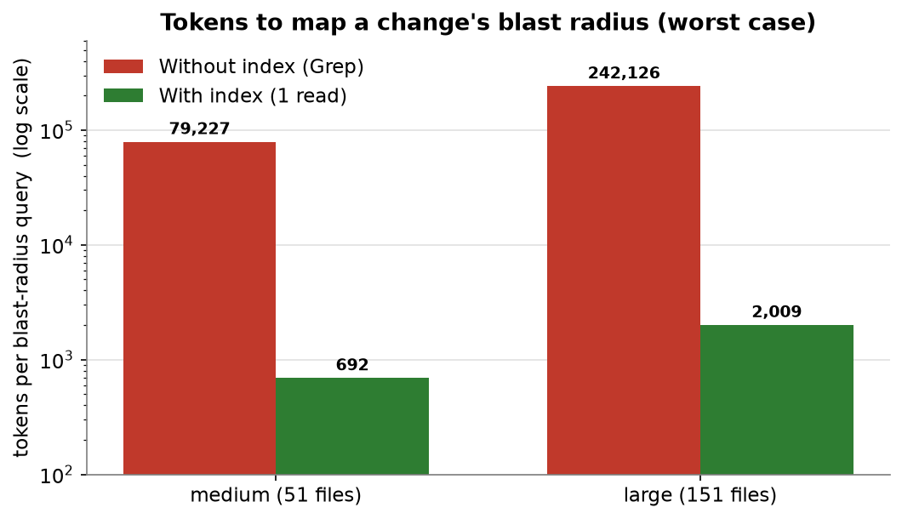
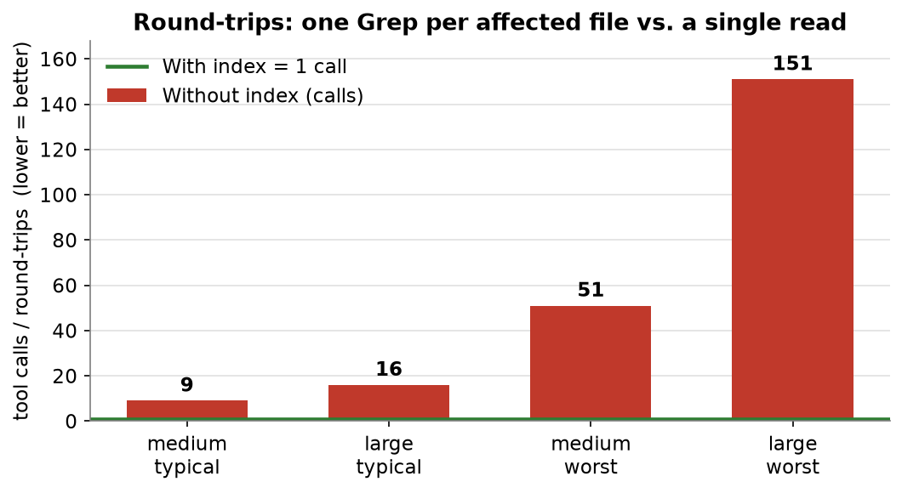
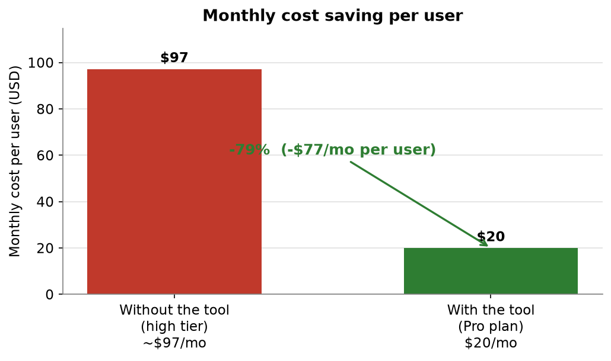
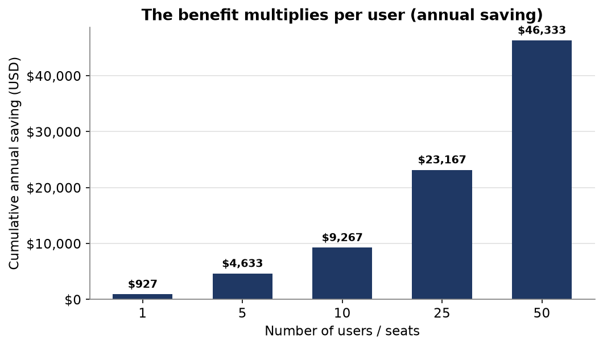

# Benchmark — `PROJECT_MAP` index vs. raw Grep navigation

## 🚀 The headline: your token budget goes **12–18× further** on everyday code navigation — up to **~120×** on big refactors

When an AI agent has to figure out *"what does this change affect?"*, the precomputed
`PROJECT_MAP.md` index turns a recursive, multi-call search into **one read**. Measured on real
and synthetic projects:


Because navigation stops eating your token allowance, **the same plan does far more work before
it hits a limit** — the practical effect is like giving a smaller plan the headroom of the next
tier up. Every token spent understanding the codebase stretches **12–18×** on a typical query.

### Tokens to map a change's blast radius — without vs. with the index (worst-case hub query)



The index bar is barely visible **on purpose**: its cost is *fixed and tiny* no matter how big
the project or its files get.

---

## TL;DR

| Metric | Typical query | Worst case (hub) | Independent real-agent check |
|---|---|---|---|
| **Tool calls (round-trips)** | **4–16 → 1** | **51–151 → 1** | 34 → 1 |
| **Tokens (realistic)** | **~12–18× less** | **~115–120× less** | ~12–20× less |
| **Accuracy** | deterministic | deterministic | precise vs. error-prone |

The index turns an *O(N) recursive search* (one tool call per affected file) into a **single
read**, and that read is **reused for free** by every later query in the session.

---

## Measured results

> Task: *"List every file transitively affected if module `T` changes"* — the blast-radius query
> the index is built for. Tokens estimated as `chars / 4`, applied identically to both strategies,
> so the **ratio** is the trustworthy figure. Each project is measured on the **hub module `m0`**
> (worst case) and as the **mean over every module as target** (typical query), to avoid
> cherry-picking. Raw numbers in [`results.json`](./results.json).

### Typical query (mean over all modules as target)

| Project | Files | Avg blast radius | Tool calls (no-map → map) | Tokens, realistic (no-map → map) | **Token savings** | **Call savings** |
|---|---:|---:|---:|---:|---:|---:|
| small  | 13  | 3.4  | 4.4 → 1  | 4,141 → 172\*  | ~24×\* | ~4× |
| medium | 51  | 8.1  | 9.1 → 1  | 12,442 → 692   | **~18×** | **~9×** |
| large  | 151 | 15.5 | 16.5 → 1 | 24,632 → 2,009 | **~12×** | **~16×** |

### Worst case (hub module — blast radius spans the whole graph)

| Project | Files | Blast radius | Tool calls (no-map → map) | Tokens, realistic (no-map → map) | **Token savings** | **Call savings** |
|---|---:|---:|---:|---:|---:|---:|
| medium | 51  | 50  | 51 → 1  | 79,227 → 692    | **~115×** | **~51×** |
| large  | 151 | 150 | 151 → 1 | 242,126 → 2,009 | **~120×** | **~151×** |

\* The small project runs the **`directed` route**: the product **deliberately does not generate a
map** below 40 files (raw Grep is cheap enough and a stale map would cost more to maintain than it
saves). The small-project figures are shown only to illustrate what a map *would* save; in
practice no overhead is added there.

---

## Round-trips scale linearly — the structural, assumption-free win

Independent of any token estimate, computing a full transitive blast radius without an index
costs **one tool call per file in the radius**; with the index it is always **one**:



Fewer round-trips means lower latency, fewer model turns, and less reasoning overhead — costs the
token estimate doesn't even capture, so the real-world gap is **wider** than the tables show.

---

## 💰 What it saves you (money, not just tokens)

Because the index slashes the tokens spent on navigation, a project that would otherwise push you
onto an expensive high-tier plan (**≈ $97/month**) runs comfortably on the **$20/month Pro plan**
instead:



That's **−79% (≈ $77/month saved per user)**. And the benefit **multiplies with every seat** on
the team:



| Users | Monthly saving (USD) | Annual saving (USD) |
|---:|---:|---:|
| 1  | $77    | $927    |
| 5  | $386   | $4,633  |
| 10 | $772   | $9,267  |
| 25 | $1,931 | $23,167 |
| 50 | $3,861 | $46,333 |

*(The plan figures are an illustrative positioning of the budget stretch, not a claim about any
specific vendor's published limits.)*

---

## What is measured (method)

- **WITHOUT the index** the agent discovers dependents recursively. To find who imports a module
  it runs one Grep; from the results it finds the next layer, and repeats until the graph closes:
  - **round-trips** = one Grep per node in the blast radius;
  - **tokens (best case)** = bytes of those Grep results, assuming *perfectly surgical* queries and
    that the agent never opens a file;
  - **tokens (realistic)** = best case **+ reading each affected file once** to trace/confirm it —
    the behaviour actually observed in the real-agent run below.
- **WITH the index** a single `Read` of `PROJECT_MAP.md` exposes the whole `by:` (dependents)
  graph, so the entire closure comes from **one** call.

### Honest counter-point — best-case Grep

If the agent could *always* issue perfectly surgical Grep queries and **never open a file**, raw
Grep is token-competitive — and for small, low-fan-out lookups it is actually **cheaper** than
loading the whole map (best-case ratio drops to ~0.1–1.7×). The index is **not** a win for an
isolated lookup of one weakly-connected symbol; it wins for **structural / blast-radius / hub /
multi-file** work and for **sessions with several navigation queries** (the map is read once, then
free). The product encodes exactly this trade-off as an automatic rule it writes into `CLAUDE.md`.

---

## Independent validation — real agent on real source

The synthetic numbers were cross-checked by running **two identical AI sub-agents** on a real
project (`MotorNote.Web`, 72 files), asked for the blast radius of a hub utility — one allowed to
use `PROJECT_MAP.md`, one forced to explore with Grep/Glob:

| | With index | Without index |
|---|---:|---:|
| Tool calls | **1** | **34** |
| Tokens (approx.) | ~1,050 | ~22,840 (**~12–20×**) |
| Result accuracy | precise (50 files) | inconsistent (54, with false positives) |

Same order of magnitude as the synthetic *typical-query* result (~12–18×), from a completely
independent method — and the index was also **more accurate** (pre-resolved, deterministic edges
vs. error-prone manual tracing).

---

## Reproduce it

```bash
# 1. scaffold three synthetic projects with realistic file sizes + a real import DAG
python scaffold.py ./_projects

# 2. generate the dependency graph / PROJECT_MAP for each (the product itself)
node ../gen-graph.mjs ./_projects/proj_small
node ../gen-graph.mjs ./_projects/proj_medium
node ../gen-graph.mjs ./_projects/proj_large

# 3. run the comparison (writes results.json)
python benchmark.py ./_projects
```

- `scaffold.py` — builds `proj_small` (13), `proj_medium` (51), `proj_large` (151) with seeded,
  deterministic imports so runs are repeatable.
- `benchmark.py` — emulates the recursive Grep search, tallies calls/tokens for both strategies
  (hub + mean), and writes `results.json`.
- `results.json` — the raw figures behind every table above.

### Caveats (so the numbers stay honest)

- Token counts use a uniform `chars/4` estimate; the **ratio** is the meaningful number, not the
  absolute.
- The "realistic" model assumes the agent reads each affected file once — an upper-ish bound,
  bracketed below by the surgical-Grep best case. The real-agent measurement (~12–20×) lands
  between the two, matching the typical-query estimate.
- Synthetic graphs are denser than some real projects; the **mean-over-all-targets** row is the
  fair representative figure, the **hub** row the worst case.
- The "smaller plan → next tier up" line is an analogy for the budget stretch, not a claim about
  any specific plan's limits.

---

*Benchmark for `claude-dependency-mapper`. The product auto-selects the strategy: it generates the
index only at ≥ 40 files, and writes a decision rule into `CLAUDE.md` so the agent reads the map
for structural/blast-radius work and uses direct Grep for isolated lookups — keeping token usage
optimal without manual intervention.*
